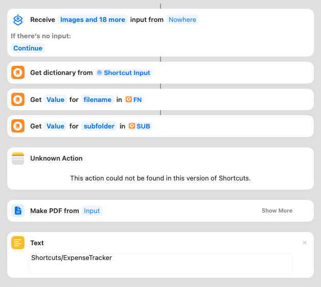

# Shortcut: Scan to Files (for Expense Tracker)

Purpose: Scan documents using the native iOS “Scan Documents” action, save a PDF to Files at `Shortcuts/ExpenseTracker[/<subfolder>]` with a filename passed from the web app, then return to Safari.

Inputs (from the app via `text=` JSON)
- `expenseId` (string) – for reference only
- `filename` (string) – e.g., `Vendor-20250826-0945-£-12-34.pdf`
- `subfolder` (string, optional) – e.g., `Trip-Paris`

Exact tap-by-tap (matches current Shortcuts UI)
1) Open Shortcuts → My Shortcuts → + (top‑right) → Add Actions

2) Search “Get Dictionary from” and add:
- Action name: Get Dictionary from Input
- Tap the blue “Input” token → choose Shortcut Input

3) Add action “Get Dictionary Value” to pull the filename:
- Action name: Get Dictionary Value
- Tap “Key” → type filename
- Tap the blue “Dictionary” token if shown and ensure it is set to the output of step 2
- Optional: tap the variable chip at the bottom and rename it to FN (for readability)

4) Add another “Get Dictionary Value” to pull the subfolder:
- Action name: Get Dictionary Value
- Key: subfolder
- Ensure “Dictionary” is the output of step 2
- Optional: rename the output variable to SUB

5) Add the scan action
- Preferred: Scan Documents (App icon: Shortcuts)
- Alternative: Scan Document (Files) (App icon: Files)
- If you added the Notes action (“Scan Document” with a Notes icon, shows a “Start scanning document” label), it also works — but this guide assumes the Shortcuts/Files variant.

6) (Optional, recommended) Add action “Make PDF”

7) Create the destination folder dynamically (only if you want subfolders per trip):
- Add action “Text” → enter: Shortcuts/ExpenseTracker
- Add action “If” → Condition: SUB is not → Empty
  - If True:
    - Add “Combine Text” → pieces: [Text from above], [SUB], Separator: /
    - Result variable will be your full folder path
  - Otherwise:
    - Use [Text from above] directly as the folder path
- Add “Create Folder” → Path: the folder path from above (Magic Variable)
- Add “Get Folder” → Path: the same folder path (Magic Variable)

8) Save the PDF file
- Action: Save File
- Ask Where to Save: Off
- Service: iCloud Drive (or On My iPhone)
- Destination:
  - If you did step 7: tap Destination → tap the Magic Variable wand → select the Folder variable from “Get Folder”
  - If you skipped step 7: tap Destination → pick Shortcuts/ExpenseTracker
- File Name: tap and insert FN (from step 3)
- Overwrite If File Exists: On (optional)

9) Final output:
- Add action “Text” → ok (ensures Safari returns with `?scan=files-done`)

10) Name the Shortcut exactly: Scan to Files

Return URLs (set by the app; no setup needed in Shortcuts)
- x-success: `<site>/?scan=files-done`
- x-cancel: `<site>/?scan=cancel`
- x-error: `<site>/?scan=error`

Notes
- The web app computes and passes `filename` and `subfolder` using Settings templates. You can adjust defaults in Settings → iOS Shortcuts.
- After return, the app prompts you to pick the PDF from Files; choose the one just saved.

Screenshots
- This repo can’t include device screenshots captured from your iPhone. If you capture them, place them under `resources/shortcuts/images/scan-to-files-step-XX.png` and reference them here like:

  ``

Troubleshooting
- I see “Start scanning document” and a Notes icon → You likely added the Notes action. That also works, but to match these steps, replace it with “Scan Documents” (Shortcuts) or “Scan Document (Files).” Use action search, type “Scan”, and pick the one with the Shortcuts or Files icon.
- “Save File” shows “Provided Input” → That’s fine if it directly follows “Make PDF.” If not, tap its File parameter and choose the PDF variable from “Make PDF.”
- I can’t choose the folder variable in Destination → Tap the Magic Variable wand in the bar, then tap the output of “Get Folder.”

Example (Notes variant UI)

